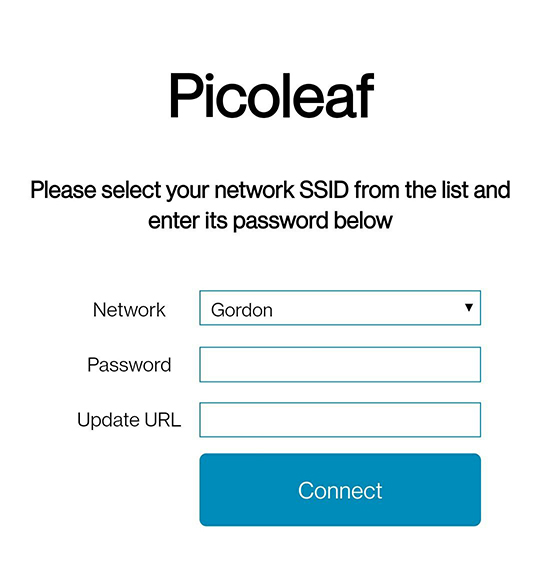

# Picoleaf-ESP8266
This is an ESP8266-based Nanoleaf-like project. Tested with the ESP-01 board, this flashes the SoC flash and uses its storage as configuration storage for WiFi connectivity.

## Build and Flash
The project uses the https://github.com/plerup/makeEspArduino build system, mainly tested on Linux. Download, and install the build environment. Then, connect the board and configure the Makefile to point to the relevant `/dev/ttyUSBXX` device and build:
```
# Build BSP, environment and code
make

# Flash the device
make flash
```

## Installation
On first use, the board will expose a new WiFi network called `Picoleaf`. Its IP address should be `192.168.4.1`. Connect to this access-point and logging to that IP address, the device serves a setup page.
  
This setup page asks you to choose your own WiFi SSID and supply its password. The last configuration field is the management URL the board should contact to get its animation and configuration. This will usually look something like: `http://<YOUR-HOSTNAME>/get`. Setting up this management interface is done by deploying this sister-repo: https://github.com/gili-yankovitch/PicoLeaf
